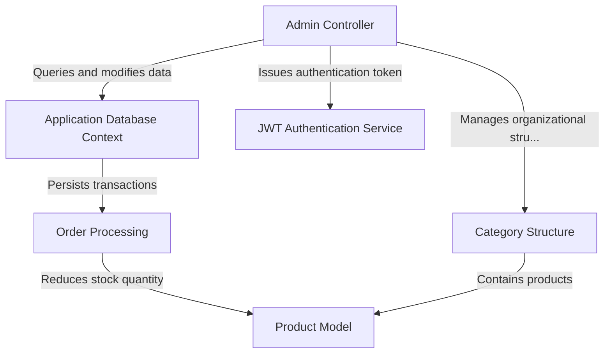

# Tutorial: SimpleSale-Platform

"MVC"
The SimpleSale Platform is an e-commerce solution designed for selling **wood products** online. It allows customers to browse items organized by *Category Structure* and place new purchases through the integrated **Order Processing** system. Administrators can securely log in using the **JWT Authentication Service** to manage inventory, set featured items, and track orders via the administrative dashboard, all facilitated by the underlying **Application Database Context**.

## Visual Overview

## Chapters

1. [Product Model
](01_product_model_.md)
2. [Category Structure
](02_category_structure_.md)
3. [Order Processing
](03_order_processing_.md)
4. [Admin Controller
](04_admin_controller_.md)
5. [JWT Authentication Service
](05_jwt_authentication_service_.md)
6. [Application Database Context
](06_application_database_context_.md)

---

Generated by [AI Codebase Knowledge Builder](https://github.com/The-Pocket/Tutorial-Codebase-Knowledge).
